# Don't Panic! It's Just a Game

It’s an escape room in a box. A co-op puzzle game I made to infuriate my friends.

This website uses affiliate links which may earn a commission at no additional cost to you.
As an Amazon Associate I earn from qualifying purchases.



The video above details the game play and brief technical details about my Keep Talking and Nobody Explodes clone. You’ll want to watch that first. What follows is additional technical detail for those who are so inclined.

## Electronics

This project is a conglomeration of parts from old projects. Having it be cobbled together from mismatched knobs and buttons gave it character and added to the authenticity as a prop IEM (improvised explosive device). As mentioned in the video, each module is run by an Arduino. Most of them are either a Pro or Pro Micro because those models are cheaper and I had several on hand already. The main controller is running a Mega 1280. I used a mega because it’s multiple serial ports aided in debugging and I used the older model because, once again, it’s been sitting idle in my project bin for years.

### Controller

The top bar holds the common game elements including the controller. When the device turns on the clock begins counting down from 5 minutes. [This display](https://www.adafruit.com/product/1270) came with a backpack and an I2C interface to easily set the values. The speaker is also managed by the controller. I had intended to play audio files, but in the end I stuck with predominantly blips and beeps because of space limitations and laziness. The ticking sound is actually a [series of very short tones](https://github.com/heathbar/keep-talking/blob/79990b0e3b222829e9eeb7a0070d692b658931db/controller/src/sounds.cpp#L101) with delays in between. Strikes and the disarm sound effect are also handled using tones. If the players do fail, I included an [explosion sound effect](https://github.com/heathbar/keep-talking/blob/79990b0e3b222829e9eeb7a0070d692b658931db/controller/src/sounds.h#L10) that I just couldn’t get right using the built in tone function. I’m sure that it’s possible. There are plenty of examples of crashes and explosions in 8-bit games, but I wasn’t able to find something I was happy with.

The controller also manages the 3 strike indicator LEDs. When the Defuser makes a mistake a strike is recorded and the clock begins counting at 1.2x. After two strikes the clock ticks at 1.5x. Three strikes and you’re out. Some modules have different rules based on the number of strikes. On the right is a back lit 16×2 character LCD display. This is used to show the serial number. Several modules have rules based on information about the serial number, such as if it ends in an even digit or if it contains a vowel. Also on the right are 3 miscellaneous indicators that light randomly and also affect the rules of various modules.

At the start of the game, the controller sends a RESET message to all of the modules. The payload of this message includes a byte that conveys all of the common state so that modules can correctly determine their solutions.

### Communication

Inter-module communication was a long journey. It’s a foundational piece to get right because the rules of many of the modules depend on and change according to what has happened in other modules. After trying (and failing) to implement both SPI and I2C I tried a few different protocols that all boiled down to some version of software serial. SPI and I2C both require the controller to initiate all communication. In this game, it’s typically the peripherals that are initiating conversation. This meant that the controller had to constantly cycle through all modules, polling for messages. I was able to get a couple of modules wired up and running this way, but it quickly became a source of friction and latency. Certainly I could be to blame, but neither protocol was able to deliver. As for software serial, that whole bag of despair stems from the lack of hardware buffers. If the receiving module is busy doing literally anything else, bits are dropped causing data corruption. No bueno.

I ignored hardware serial for a long time because it was convenient to reserve it for programming and debugging. Not to mention, I wasn’t aware of an Arduino board that had 11 hardware serial ports. I found a couple of shields, but they were expensive and I’d need 2 or 3 of them to cover my bases. That’s when the light bulb hit me. I started thinking about mesh networks, and realized that each module didn’t need to broadcast to all other modules, not exactly. I needed (or strongly wanted) each module to be able to initiate communication, and that message would need to be delivered to all other modules, but it didn’t need to be direct delivered. So rather than a hub and spoke model, I connected the TX and RX pins in a big loop.

Before long, the wiring harness shown in the video made it’s debut. The wiring harness brought power to the modules and provided the communication loop. During the build, I frequently would pull one or more modules out and replace them with a jumper (to keep the loop in tact). This flexibility was a real time saver.

I created a [simple software protocol](https://github.com/heathbar/keep-talking/blob/main/shared/src/chat.cpp) to reduce code duplication and ensure the modules were speaking the same language. The format is a fixed 4 byte sequence as follows {message header} {sender ID} {message type} {message payload}.

The header is always the same. I toyed around with a header and footer when I was losing bits and bytes in hopes to recover from a corrupted message. It worked, but if you miss an important message like strike or a disarm message, no amount of recovery will be successful. This could likely now be removed, but that would me reprogramming all 12 Arduinos.

The sender ID is checked against every incoming message. If I receive a message from myself, I can safely ignore it, since it must have made it’s journey through the entire loop.

The [message type](https://github.com/heathbar/keep-talking/blob/79990b0e3b222829e9eeb7a0070d692b658931db/shared/src/chat.h#L23) is one of a fixed list of messages that can be sent.

Some messages, such as the RESET message described above include payloads. Others such as the STRIKE message do not.

Once communication was sorted out, the ideas really started flowing, and the modules began materializing quickly.

## Modules

### Hieroglyphics

*I’m not sure what these symbols are, but I suspect they have something to do with Nicholas Cage and some sort of national treasure.*

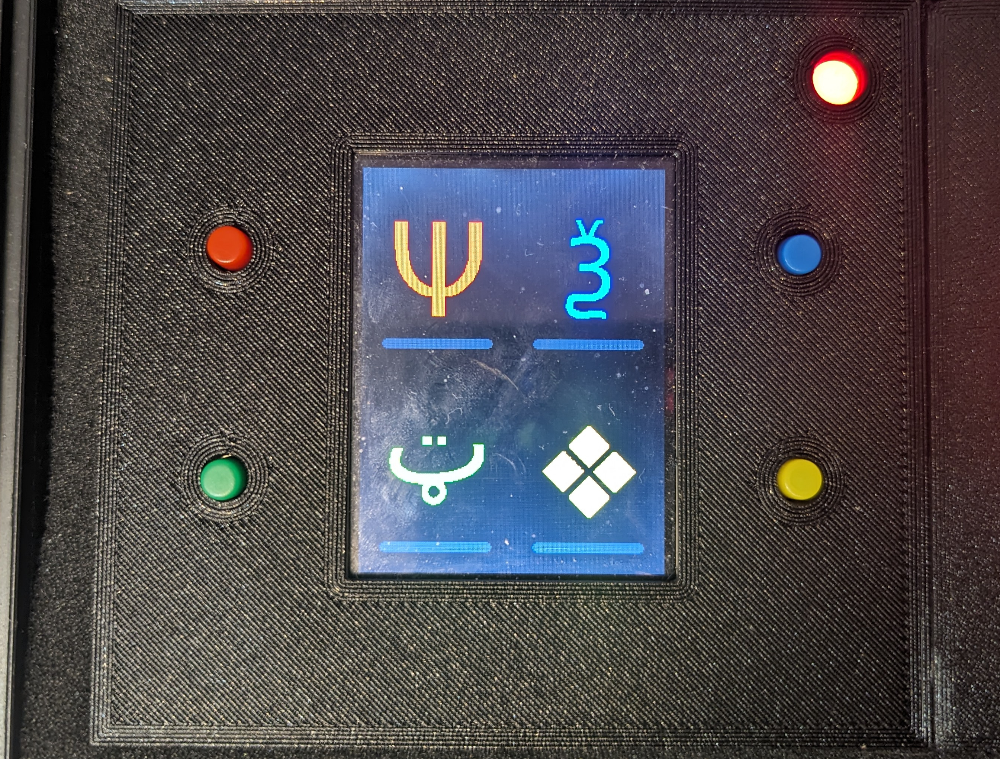

This module was adapted from the original game. My version draws 4 pseudo-random glyphs on an Elegoo TFT screen. Next to each glyph is a corresponding, similarly colored button (although this picture doesn’t represent that well – it looks much better in person). To disarm the module, the Defuser must push the four buttons in the correct order, based on the rules in the manual.

From a hardware perspective, this is one of the simpler modules. I purchased an LCD display Arduino shield and plugged it in. There was a short moment of panic as I sorted out how to get the 4 buttons and 2 LEDs to interface with the Arduino, as the shield left me with no extra pins. Ultimately, the SD card reader (included on the shield) had to be sacrificed. This created a squeeze on the software as storage space was now at a premium. Twenty Seven bitmap images are [embedded in the source code](https://github.com/heathbar/keep-talking/blob/main/module-hieroglyphs/src/bitmaps.h), with only a few bytes to spare.

### Counter

*There are 10 types of people in the world. Those who can count in binary and those who cannot.*

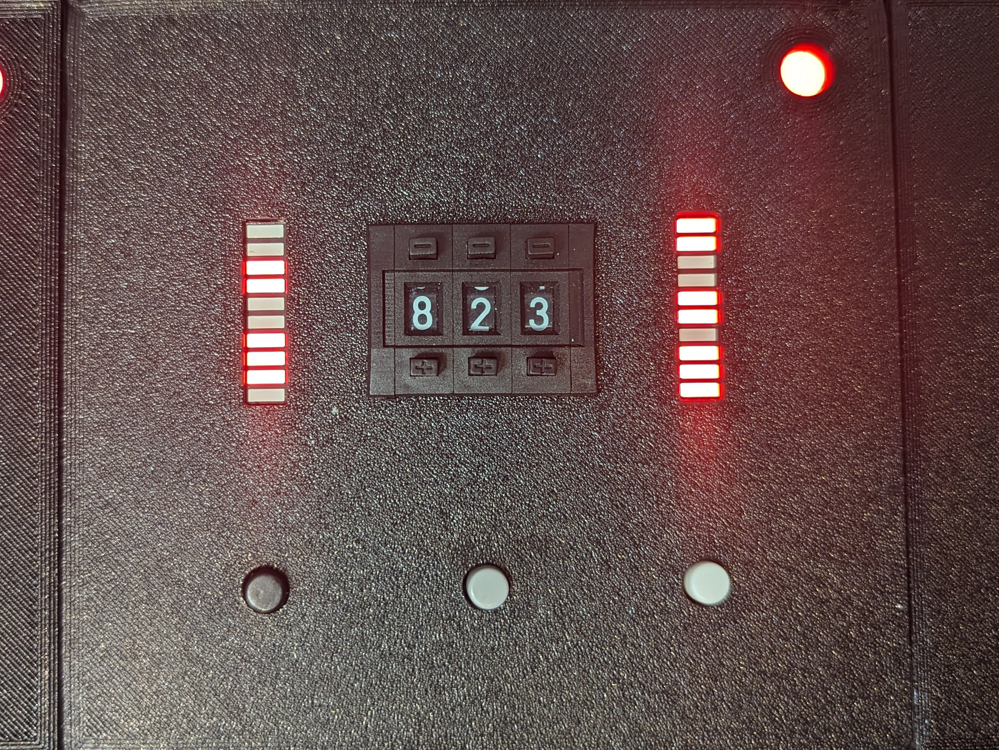

The counter module is one of my own designs. The bank of 10 LEDs on the left lights up in one of 20 patterns. To disarm, the team must identify the pattern, then input the corresponding number (documented in the manual) into the counter in the center. Finally, the Defuser must press the correct [button](https://amzn.to/3vKnFNi) at the bottom based on the configuration of lights on the right.

Underneath, this is one of the messier modules.

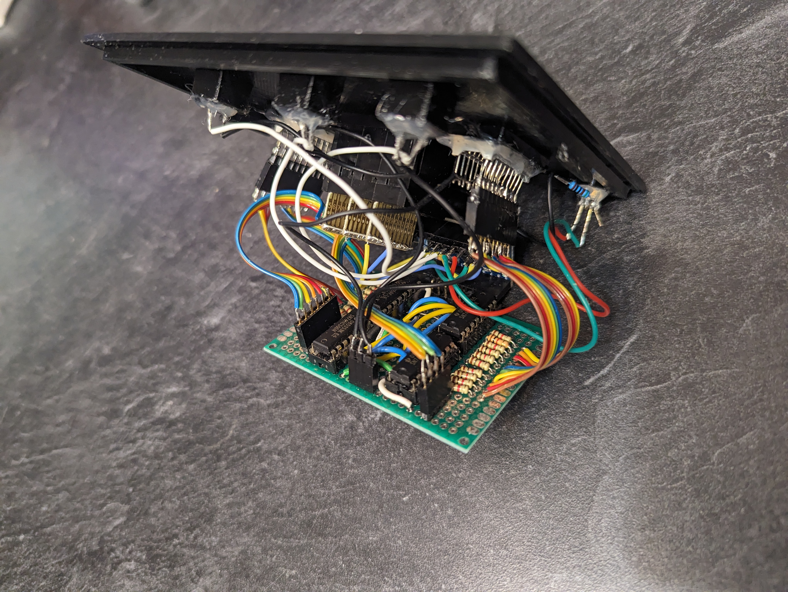

The two LED banks are simply that, a package of 10 individual LEDs. They were overstock from [a previous project](https://heathpaddock.com/2012/06/27/spectrum-analyzer/) that I never finished. Each bank includes 10 anodes, 10 cathodes, requires 10 resistors. I used SN74HC565N shift registers to manage them. Each of the 3 [counter digits](https://www.adafruit.com/product/1084?gad_source=1&gclid=CjwKCAiA44OtBhAOEiwAj4gpOc38zDWKSmVpLpml5UDsUzyUJ26KXyy1zu-ifUXBwPiKeM1AG1x8xBoC_3MQAvD_BwE) coincidentally also required 10 pins, plus a common pin. Which ever digit is active on the display, that pin will be connected to the common pin. It’s a primitive design the means I had 30 more pins to connect and read voltage from. To get that number down to a more manageable size, I multiplexed the 3 digits together, then got creative with reading values. Instead of testing 10 different wires to determine which was being pulled to ground by the common pin, I setup the 10 digits as outputs and the common pin as the sole input. Next, I wrote a loop to go through, pin by pin, turning on the pin for each digit, one at a time and reading the common pin to determine if it was connected. I did this because outputs, in this case, were more readily available–I simply had to add an extra shift register. Oh, and to make things interesting, the counter was wired between the two LED banks, and also the led bank on the right changes based on the value entered into the counter. That all amounted to some [fun juggling](https://github.com/heathbar/keep-talking/blob/79990b0e3b222829e9eeb7a0070d692b658931db/module-counter/src/main.cpp#L194) in the code that updates the shift register. It took me a good long while to get those bits in a row, but they dance a beautiful dance now.

Here’s a secret. Both LED bars are binary representations of decimal numbers. The left bar is the binary representation of the solution while the right bar is the binary representation of whatever was put into the counter. Therefore, if you know this secret and can read binary numbers, you don’t need the experts to solve this module.

### Wires

*Wires are the lifeblood of electronics! Wait, no, electricity is the lifeblood. Wires are more like the arteries. The veins? No matter…*

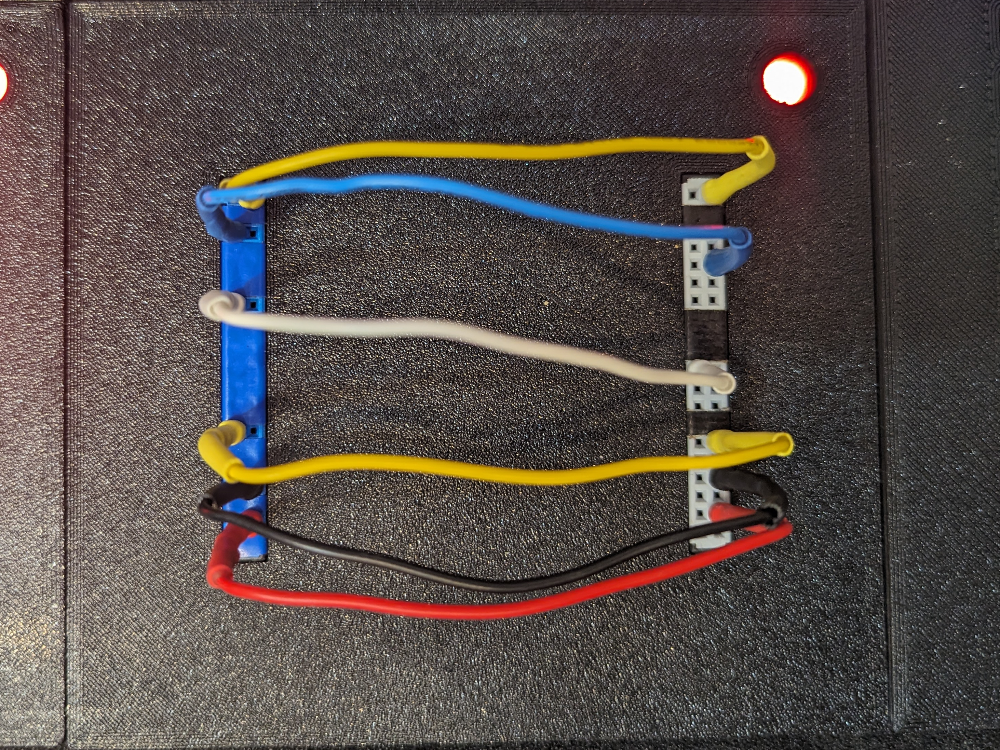

The wires module is another module I copied from the original game. It’s unique in that it is the only module that requires resetting between playthroughs. Players can connect between 3 and 6 wires in any order. The device can detect the configuration of wires and the manual (copied from the original game) accounts for every possible combination. It’s one of this simplest modules, yet one aspect of its design stumps a lot of people: how does the game determine the color and configuration of the wires?

Hidden inside of the plug at the end of each wire is a resistor. Based on this value, the micro-controller can detect the presence and color of each of the wires.

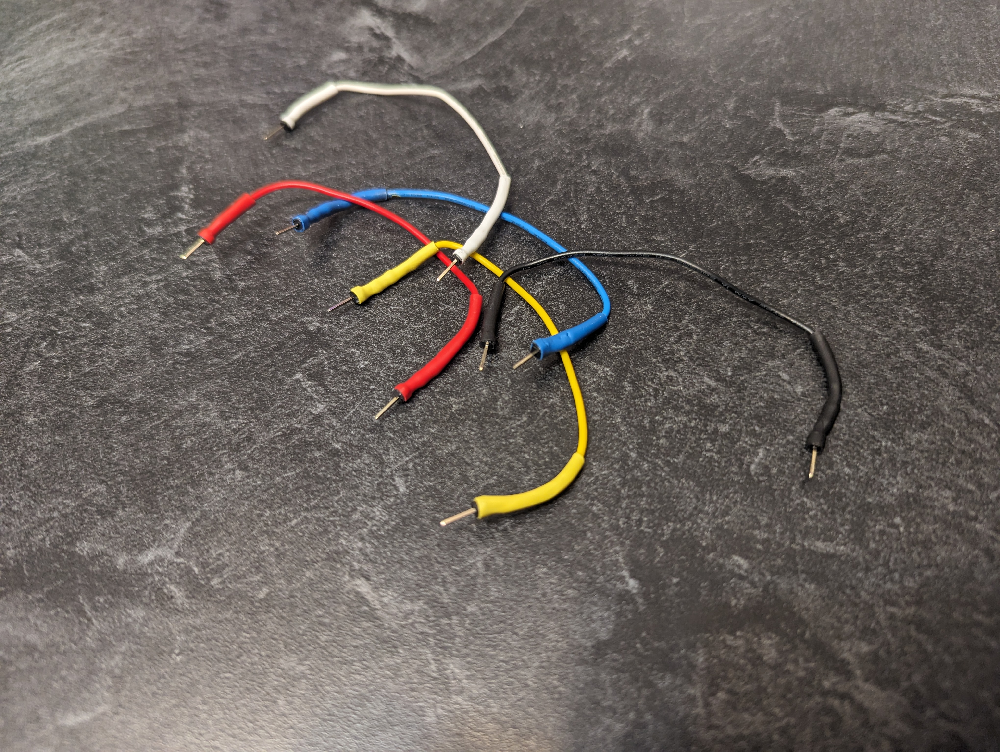

### Maze

*This seems to be some kind of maze, probably stolen off of a restaurant placemat.*

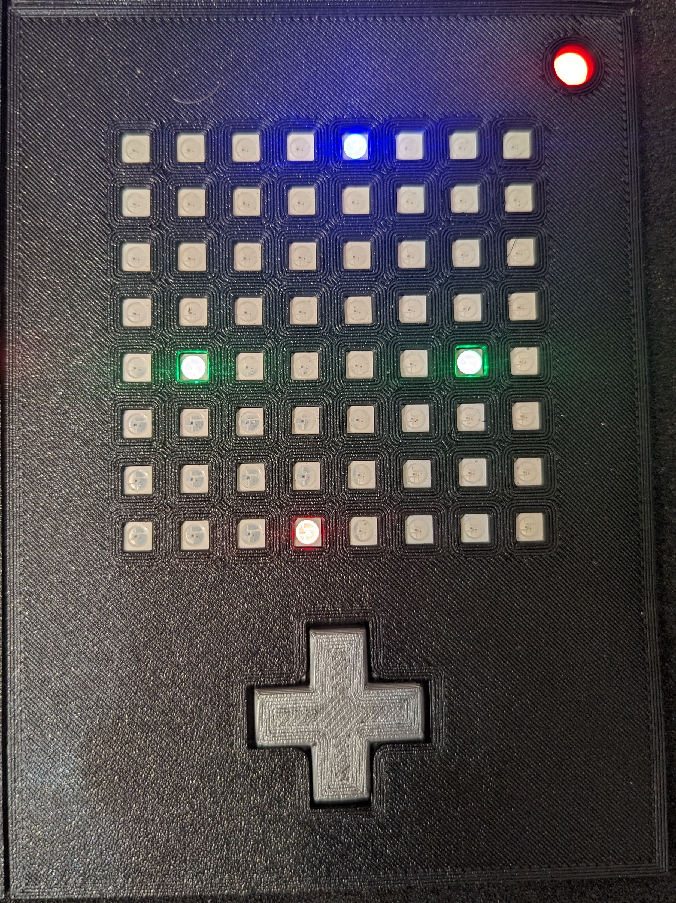

The maze module follows the same principals of the maze module in the original, but some changes were made. If my goal was to stay true to the original game, I would have needed to use another LCD screen, but if I was going to litter this project with screens, we might as well play the [original video game](https://keeptalkinggame.com/). Instead, I found an [8×8 Neo Pixel grid](https://amzn.to/3u2Peku) and it performs the role soundly.

To disarm this module, the Defuser must navigate the blue dot to the red dot. The complication is that this is a maze, and there are walls that the Defuser cannot see. Bumping into a wall results in a strike. The location of the green registration marks indicate to the experts which set of walls are in play so that they can safely navigate to safety.

The maze module should have been a simple module with respect to hardware, but it was a huge pain in the neck.

The frustration started when messages started getting corrupted. That is one major downside to the communication ring. When something goes wrong, it’s not immediately clear who is causing the problem. Sometimes the game would work, sometimes it would go haywire. After weeks of troubleshooting I determined that the Neo Pixels were to blame. They require a very specific timing–so specific that they cannot be bothered by anything else. The library authors disable all interrupts, including the interrupts used for serial communication. In other words, when a message arrives while the LEDs are being updated, the bytes, or sometimes parts of a byte is lost–leading to corrupted data.

I solved this issue like a professional, by I throwing more hardware at the problem. The first Arduino sits on the communication ring, casually forwarding messages and storing any that are relevant to the maze module. The second Arduino runs the maze module, and between LED updates, it’s queries the first Arduino for any messages that have arrived since the previous query. By isolating the two tasks, we prevent lost and corrupt data.

Frustrations aside, this was a really fun module to [program](https://github.com/heathbar/keep-talking/tree/main/module-maze/src) (if not a bit tedious). Figuring out how to represent the maze in code and navigate the user through the maze was an engaging challenge. I took some notes from [The Coding Train’s](https://www.youtube.com/@TheCodingTrain) series on [maze generation](https://www.youtube.com/watch?v=HyK_Q5rrcr4).

### Simon Says

*This is like one of those toys you played with as a kid where you have to match the pattern that appears, except this one is a knockoff that was probably purchased at a dollar store.*

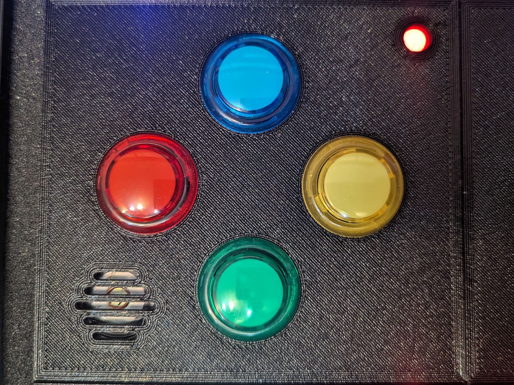

Simon Says was the first module I printed, wired and programmed. It is another module I replicated very closely to the original game. Like it’s namesake, [lighted buttons](https://amzn.to/3SfzWSO) flash in an increasingly long sequence. The player must input the correct sequence in response. However, in this version, the response sequence will be different based on a number of factors such as the serial number and how many strikes have been recorded.

This module also controls the games difficulty. Holding one of the four colored buttons during the boot process changes how many modules are required to be disarmed to win and how many minutes the team has to do so.

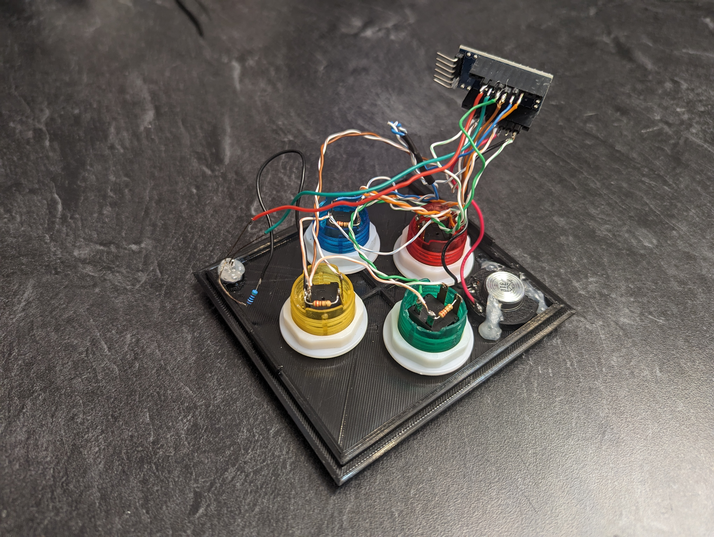

### Password

*Fortunately this password doesn’t seem to meet standard government security requirements: 22 characters, mixed case, numbers in random order without any palindromes above length 3.*

The password module varies in a few small ways from the original game, but the game play is largely the same. Players must work with a set of letters to find the single combination that matches a word in the manual. Each of the four positions contains a pool of six letters. The four buttons beneath the display cycle through the six letters in their respective positions. Once the correct word is formed, the Defuser presses submit to disarm the module.

This was the first (and last) 3.3V module. For whatever reason, the [alphanumeric displays](https://www.sparkfun.com/products/16916?gad_source=1&gclid=CjwKCAiAqY6tBhAtEiwAHeRopU5b_jFnCTs1xIKO4AbPvYCOdmItplaLBFxaizQB1sDxDtHhKrfcHBoCmQMQAvD_BwE) aren’t provided in a 5V version. This meant that I had to step the power and communication lines down and back up again to accommodate this module. I should have just bought an IC to do this, but I’m stubborn and hacked together a fake one with a voltage regulator and some diodes.

After my kids memorized the word list, they would just furiously tap through options looking for words they recognized. I had dilemma. I wanted to make the module harder for experienced players, while keeping it relatively the same for beginners. The solution I came to was to double the number of passwords and split them into two lists. The state of the “Alt” indicator light determined which word list was in play. Additionally, I added multiple words from the wrong list into the available options. If you’re simply hunting for any recognizable word you have a low chance of guessing correctly. This solution has worked well to not overwhelm newer players, but is complicated enough to slow down experienced players.

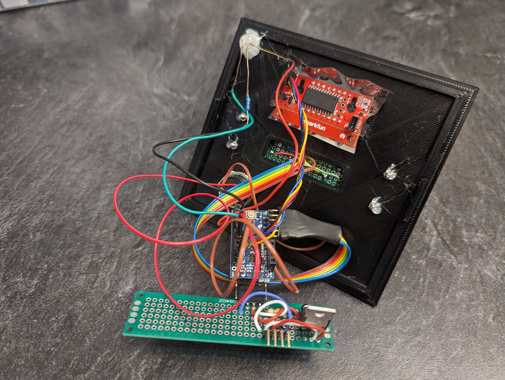

### Buttons

*You might think all buttons are for pressing. That’s the kind of thinking that gets people exploded.*

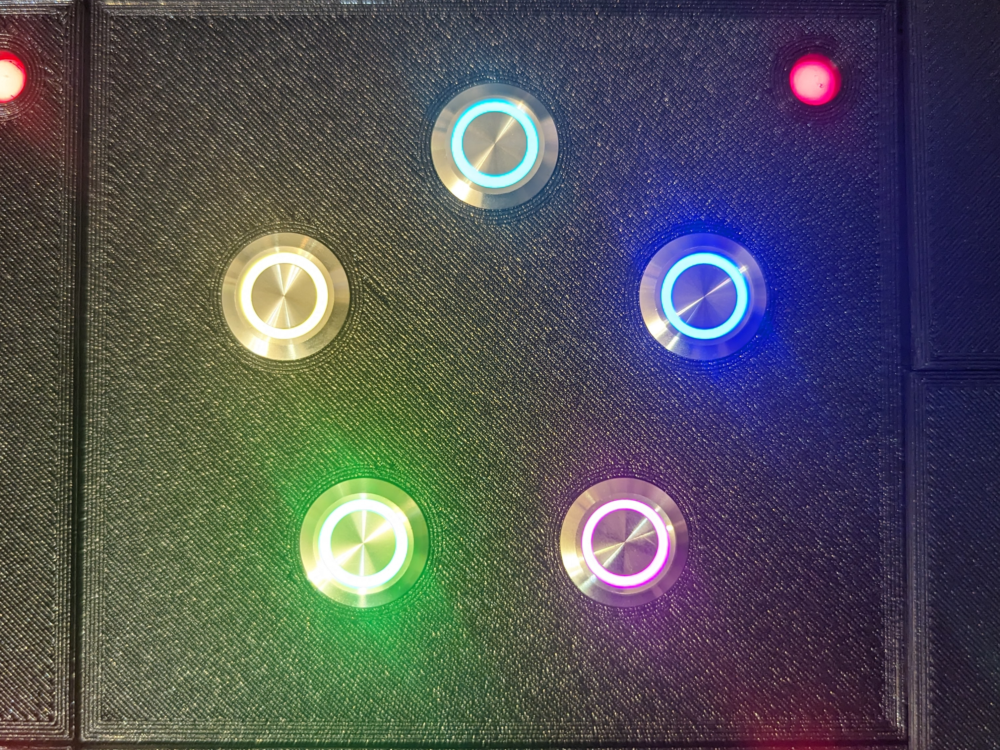

The idea for this module started from the original big button module in the video game, but it evolved into something quite different. The 5 [buttons](https://www.adafruit.com/product/3350) here each contain an RGB LED ring. The rings blink and flash different color patterns. Based on the patterns each button makes, the Defuser must press the button a specific number of times, or press and hold until a certain number is on the clock, or not press the button at all. I may rethink this module entirely because my kids have memorized every possible pattern and no longer need the manual or the experts.

I used a TLC5940 LED driver to drive the LEDs. This is an old chip I used to use to control RGB LEDs before the NeoPixel was invented. Unlike shift registers used elsewhere in this project, the TLC5940 is capable of PWM, which allows for color mixing and dimming. In an earlier version of this module, I differentiated between a light blinking on and off and fading up and down. Unfortunately, this subtlety was lost on most people, leaving them annoyed. There’s a fine line between frustrated and annoyed. As a game designer, you don’t want your players annoyed by the game, you want them frustrated with themselves for not getting it right. When a player loses a round, you want them to think it was their fault so that they can immediately see how to do it differently the next time. This leads to a sense of progress and fulfillment when victory is achieved.

### Memory

*Memory is a fragile thing but so is everything else when a bomb goes off, so pay attention!*

This module is a mean girl. It’s significantly harder than the rest of the modules we’ve looked at. The input controls are a bit different, but the ruleset is identical to the original game. A digit appears in the blue display. In response the Defuser must select the appropriate digit in the white display. This sequence is repeated four times and on the last time, the Defuser will be required to select either a number or a position from one of the previous stages. For example, “select the number in the same position you selected in stage 2” or “select the same number you selected in stage 1”. As you’re going along, you’ll need to remember both the digits that was selected in each stage and the position it was in. If an incorrect guess is made, it results in a strike and the module is restarted from stage 1. #Memory

On the hardware side, this is another monstrosity. If memory serves correct (pun intended) the [4 white digits](https://www.sparkfun.com/products/11409) are multiplexed, and fed by a single shift register. This one didn’t come with a backpack. The lucky [blue digit](https://amzn.to/3tVcpgQ) has its own shift register to drive its 7 segments. The linear resistor is used to choose a digit and toggling the the toggle switch submits the selection. There are also 5 LEDs across the top that indicate the current stage. I combined those with the red/green status LED on a third shift register.

### Clock

*Why did the boy throw the clock out of the window? Because it had a bomb strapped to it.*

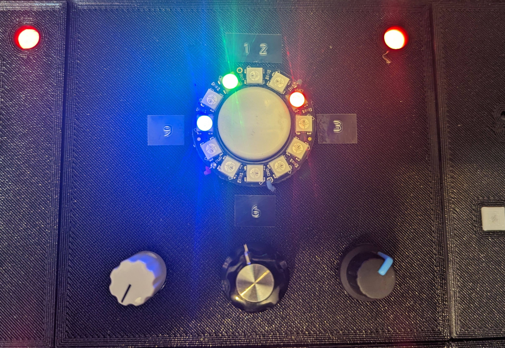

The clock module is one of my own design, and unfortunately, poorly received. If you have an idea on how to make this module more appealing, let me know in the comments below. The current design imagines the Neo Pixel ring as a clock. The blue, green and red LEDs stand it for the hour, minute and second hands on a clock respectively. Given the time at the start of the game, the Defuser must change each of the 3 hands using the 3 knobs in accordance with the rules in the manual.

Thankfully, this [Neo Pixel ring](https://www.adafruit.com/product/1643) has not been known to cause the blocking issues the larger grid did. Perhaps it’s due to the shorter length resulting in much quicker updates to the strip, leaving more time for serial communication.

### Keypad

*They say not to make your pin number easily guessable. That’s why I chose the last 4 digits of pi.*

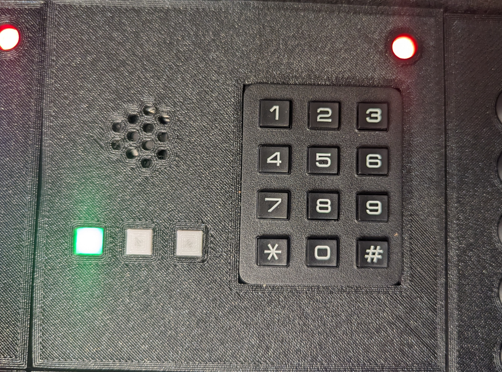

The keypad module is a reinterpretation of the Morse code module from the original game. To get started, the Defuser must dial the correct sequence based on the serial number and other indicator LEDs.

If successful, the keypad module begins beeping out a word in Morse code. The Experts identify the word and relay the appropriate five digit pin number back to the Defuser who must enter it into the keypad. This process is repeated another two times.

Since the [keypad](https://amzn.to/3SiblNa) resembles an old telephone interface, I wanted it to play the same DTMF tones. Call it nostalgia. DTMF stands for Dual Tone Multi Frequency, meaning that each tone is actually a combination of two tones. Each row plays a unique tone and at the same time each column plays a different unique tone. For example, pressing the 6 key plays the tone for row 2 and column 3 at the same time. I imagine old systems use FFTs or band pass filters to separate the two tones and identify the row and column like an xy coordinate system to determine which button was pressed.

Like the Simon Says module, I included a [speaker](https://amzn.to/3Sg6zjp) on this module because tracking the timing, speed and state of the sounds was complicated enough without having to communicate all of that over the network. In an effort to not include two speakers, I spent a very long time trying to get one Arduino tone() call to play two different tones. Lots of math, lots of tight loops, trying to straddle both frequencies. It was futile. In the end the solution was much simpler. Use two pins, each with their own timer; plug the speaker into both pins. Bingo.

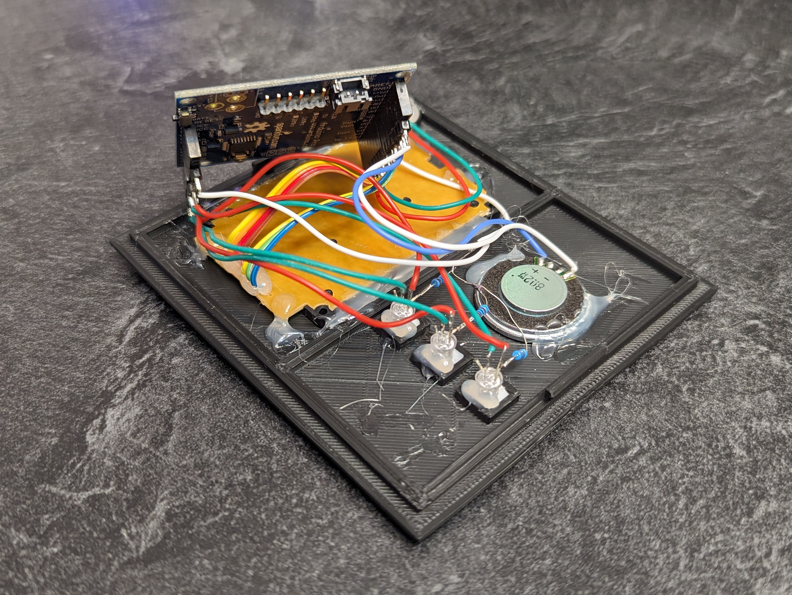

### Mastermind

*Like the game of the same name, break the code through deduction, logic, and a bit of guess work. Just don’t make an incorrect guess.*

My family enjoys the game Mastermind, and after the Maze module consumed a little extra physical space, it left room for another large module. I came across these appropriately colored toggle buttons and the rest fell into place.

It’s difficult to see from the picture, but these are [toggle buttons](https://amzn.to/3tWwL9l), not momentary, which means they click in and out like a ball point pen. Like the game, the goal is to guess the correct four color sequence. In this version, you do have an unlimited number of guesses, but you are restricted by time. Unlike the game, you’re unable to see your previous guesses.

A valid guess consists of exactly one depressed button in each column. If you have too few or too many buttons pressed down, it will result in a strike. To make your guess press and hold the button labeled TEST. If you’re correct, the module disarms. If not, the 4 RGB LEDs in the lower right will light up in a pattern. The pattern indicates which columns are correct and which are incorrect. To make things a little more spicy I included multiple patterns that indicate the same state.

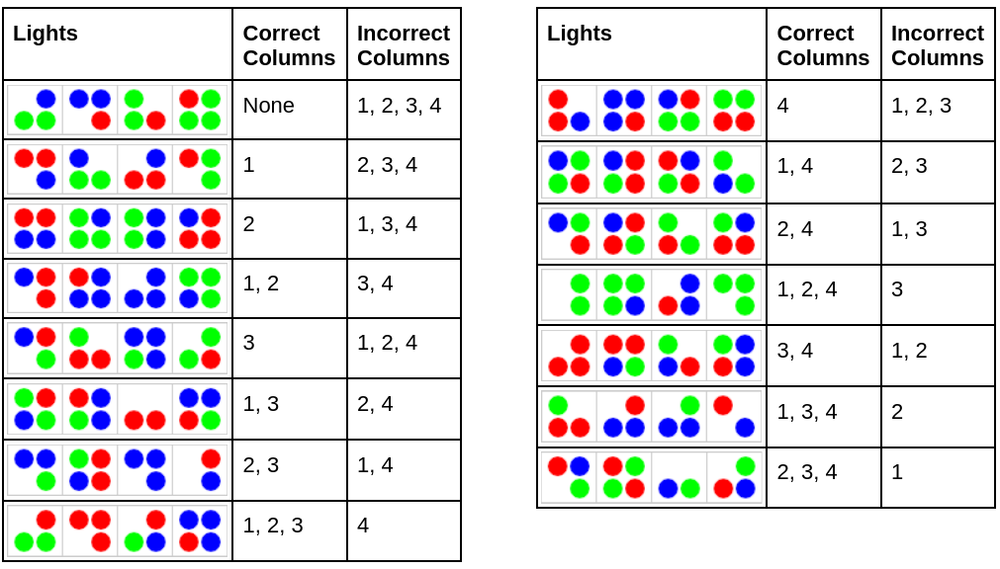

It’s fascinating to watch different teams solve this module. How would you communicate the colors of the LEDs? Some teams spend loads of time describing the color and position of each LED while others give no position information, but instead provide a count of each color and others rattle off the colors in whatever sequence makes sense to them “blue blue red green” assuming their expert will understand the order.

I knew the wiring for this module would be fun. I was not disappointed. I had to completely redo it several times. With this many buttons, I knew I was going to multiplex them. What I did not account for was that my experience multiplexing LEDs lulled me into a false sense of expertise. It turns out the diode inherent in every LED is an important ingredient in the multiplexing cake. I tried multiple wrong ways using fewer diodes than required. Each time, fully confident that this was the design that was going to work. In the end, every button got its own diode and, surprise surprise it worked like a charm.

## Case & Materials

The [case](https://amzn.to/3U64AzD) was purchased. It was a challenge to find something in the exact right size. As laptops have gone smaller, so have the cases. I needed enough room for all of the modules, but not something too unwieldy. This case has proven to be a great addition to the project. The foam inside keeps the modules more/less floating, saving them from jarring impacts. The top of the case also came with mounting holes that made it easy to attach the necessary components.

As mentioned in the video all of the internal structure and modules were 3Dprinted. My first few prototypes were built with wood, but I used this project as an excuse to finally buy a 3D printer. I opted to go for the [Creality Ender 3 S1 Pro](https://amzn.to/48wypO8) on a recommendation from a friend. It seems to do the job, but then again, I have nothing to compare it to.

I used OnShape to draw the [3D models used in this project](https://cad.onshape.com/documents/1cb3868ed2d3c0447e2ed41b/w/28ef7c0efd9f16ed93a0cdae/e/e6a5d2a66fdf6461aecde693?renderMode=0&uiState=65a49e363f903747f7c49a95). It was plenty powerful to handle my admittedly simplistic needs for this project.

## Cost & Time

I’m frequently asked about how long this project took and how much it cost. The answer for both is: a lot.

Start-to-finish was around 6 months of calendar time. I spent most all of my free time on evenings and weekends during that period. Easily several hundred hours. As mentioned above, I bought a 3D printer for this project, so part of that time was spent learning how to 3D model the components, not just the software, but also learning what shapes do and do not print well on an FDM printer. I also learned all about materials. Contrary to what the internet says, I had a lot more success with PETG than I did with PLA, though both are present in the final build. I still have a lot to learn in this space.

The exact cost is difficult to calculate since I was using a lot of leftover components from other projects-often times components that you can’t buy individually. That said, on average, each module contains $25 in electronics. The case was $100. I already had the Arduino Mega and the battery bank, but those are $50 each new. So… a lot.

## Conclusion

I had an absolute blast designing, developing, refining and debugging this project. I am regularly both thrilled and humbled by the feedback I get from players enjoying this game. I hope it inspires you to go create something incredible.